# Django To-Do App with CI/CD Pipeline

A simple todo app built with django

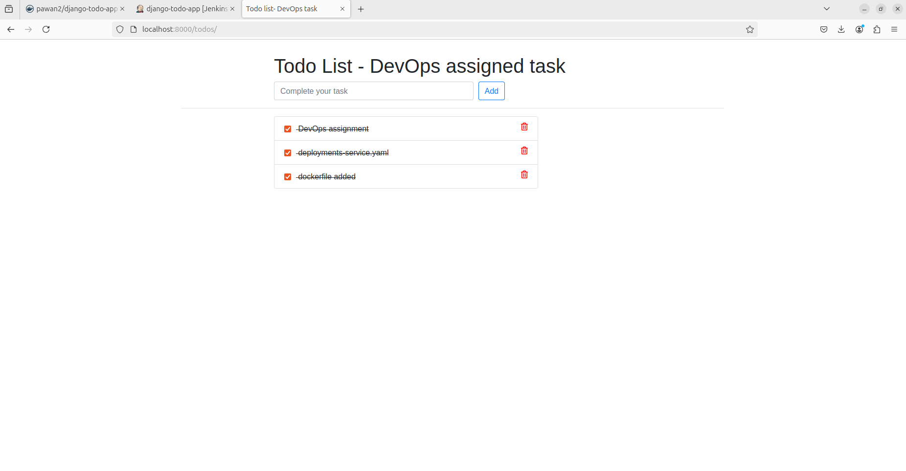

## Overview

This project demonstrates a complete DevOps lifecycle for a Django-based To-Do application. It covers:

- Setting up and running the application locally.
- Creating an automated CI/CD pipeline using Jenkins, which automatically triggers the pipeline on code changes.
- Building the Docker image and pushing it to a Docker registry.
- Creating a Kubernetes `deployment-service.yaml` file to deploy and expose the Dockerized application.
- Deploying the updated application to the Kubernetes cluster using the `kubectl apply` command.
- Testing and verifying the deployment on Minikube.

## Prerequisites

- **Docker**: Install Docker on your local system. Refer to [Docker Installation Guide](https://docs.docker.com/get-docker/).
- **Kubernetes**: Set up a local Minikube cluster. Refer to [Minikube Installation Guide](https://minikube.sigs.k8s.io/docs/).
- **Jenkins**: Configure Jenkins with the following:
  - **Credentials**:
    - DockerHub credentials (`DOCKER_CREDENTIALS_ID`)
    - Kubernetes token (`KUBERNETES_CREDENTIALS_ID`)
    - GitHub token (`github_token`)
  - **Required plugins**:
    - Pipeline
    - Kubernetes CLI
    - Git
    - Docker Pipeline
- **Python**: Ensure Python 3.8 or above is installed for local development.

## Local Setup

1. **Clone the repository**:

   ```bash
   git clone https://github.com/Pawan3168/devops-assigned.git
   cd devops-assigned
   ```

2. **Install dependencies**:

   ```bash
   pip install -r requirements.txt
   ```

3. **Run the application**:

   ```bash
   python3 manage.py runserver
   ```

4. **Access the application** at [http://127.0.0.1:8000](http://127.0.0.1:8000/).

## Dockerize the Application

The application has been Dockerized with the following steps:

1. **Writing a Dockerfile**: A `Dockerfile` created to containerize the Django application.
2. **Building the Docker Image**: The Docker image built locally using the `Dockerfile`.
3. **Pushing the Image to Docker Registry**: The built image was pushed to a Docker registry for deployment.

Here is an image showing the process of building the Docker image and pushing it to the Docker registry:

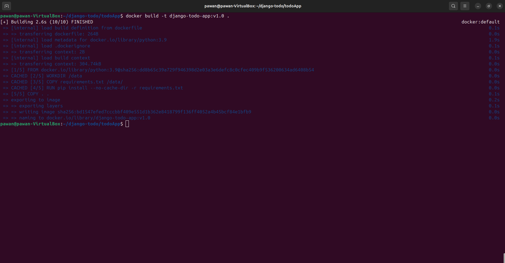
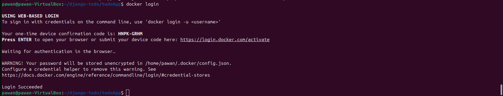
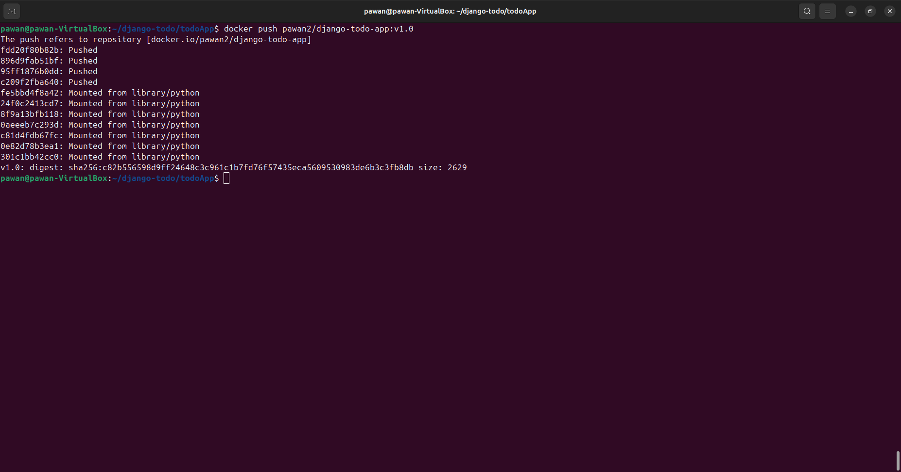
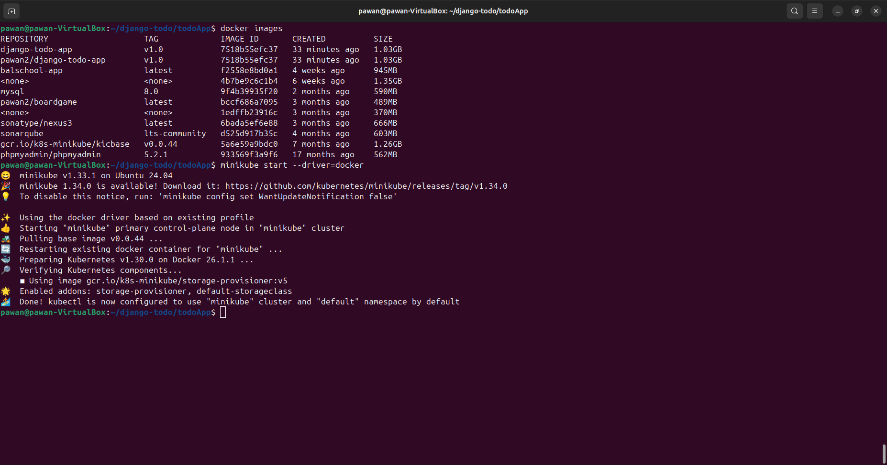
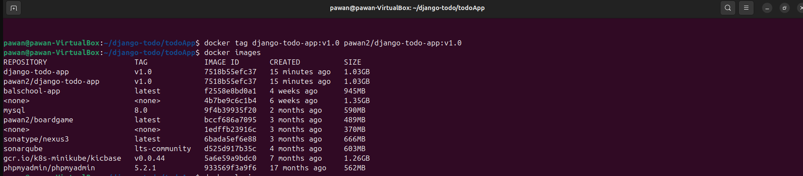

## Kubernetes Deployment and Service

To deploy the Dockerized Django application to Kubernetes, a combined `deployment-service.yaml` file created with the following steps:

1. **Creating the Deployment**: The `deployment` configuration within the YAML file defines the Docker image, replicas, and other deployment settings.
2. **Creating the Service**: The `service` configuration within the same YAML file exposes the application, making it accessible.

This combined file simplifies the deployment and service configuration for the Kubernetes cluster.

Here is an image showing the `deployment-service.yaml` file:

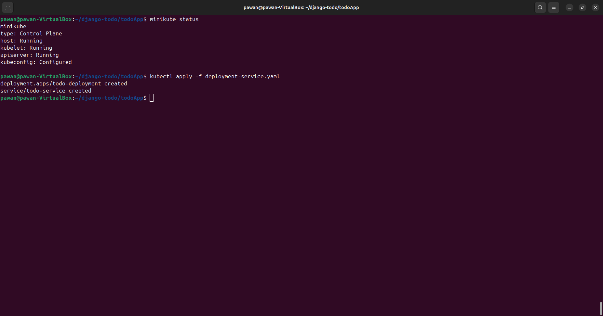
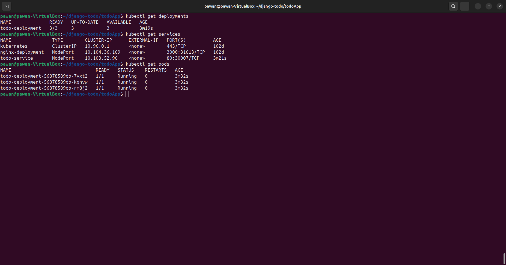

## Jenkins Pipeline Script (Jenkinsfile)

To automate the CI/CD process, a Jenkins pipeline script (`Jenkinsfile`) was created to perform the following steps:

1. **Pull the Latest Code**: The pipeline pulls the latest code from the GitHub repository to ensure the most up-to-date version is used for building and deployment.
2. **Build the Docker Image**: The pipeline then builds a Docker image using the latest code, based on the Dockerfile.
3. **Push the Docker Image to a Docker Registry**: After building the image, the pipeline pushes the image to a Docker registry (such as DockerHub) for easy access and deployment.
4. **Deploy the Updated Application to Kubernetes**: Finally, the pipeline deploys the updated Docker image to the Kubernetes cluster using the previously created `deployment-service.yaml` file.

Below is the Jenkins pipeline script that automates these steps:

```groovy
pipeline {
    agent any

    environment {
        DOCKER_IMAGE_NAME = 'pawan2/django-todo-app'
        DOCKER_CREDENTIALS_ID = 'aa4976c6-5452-4046-b414-2eb8e634ca87'
        KUBERNETES_CREDENTIALS_ID = 'kuber-token'
        GIT_URL = 'https://github.com/Pawan3168/devops-assigned'
    }

    stages {
        stage('Git Checkout') {
            steps {
                git branch: 'main', credentialsId: 'github_token', url: "${GIT_URL}"
            }
        }

        stage('Read Current Version and Increment') {
            steps {
                script {

                    def currentVer = 'v1.0'  // Default version for the first run

                    def (major, minor) = currentVer.replace('v', '').split('\\.')

                    minor = (minor.toInteger() + 1).toString()

                    def newVersion = "v${major}.${minor}"

                    // Set the updated version in environment
                    env.DOCKER_IMAGE_TAG = newVersion
                    echo "New version tag: ${env.DOCKER_IMAGE_TAG}"

                }
            }
        }

        stage('Install Dependencies') {
            steps {
                script {
                    echo 'Installing dependencies...'
                    sh 'pip install --break-system-packages -r requirements.txt'
                }
            }
        }

        stage('Run Tests') {
            steps {
                script {
                    echo 'Running tests...'
                    sh 'python3 manage.py test'
                }
            }
        }

        stage('Build and Tag Docker Image') {
            steps {
                script {
                    echo "Building Docker image ${DOCKER_IMAGE_NAME}:${DOCKER_IMAGE_TAG}"
                    sh "docker build -t ${DOCKER_IMAGE_NAME}:${DOCKER_IMAGE_TAG} ."
                }
            }
        }

        stage('Push Docker Image') {
            steps {
                script {
                    echo "Pushing Docker image to DockerHub..."
                    withCredentials([usernamePassword(credentialsId: DOCKER_CREDENTIALS_ID, usernameVariable: 'DOCKER_USER', passwordVariable: 'DOCKER_PASS')]) {
                        sh "echo ${DOCKER_PASS} | docker login -u ${DOCKER_USER} --password-stdin"
                        sh "docker push ${DOCKER_IMAGE_NAME}:${DOCKER_IMAGE_TAG}"
                    }
                }
            }
        }

        stage('Deploy to Minikube') {
            steps {
                script {
                    echo 'Deploying application to Minikube...'
                    withKubeConfig(
                        credentialsId: KUBERNETES_CREDENTIALS_ID,
                        serverUrl: 'https://192.168.49.2:8443' // Minikube Kubernetes server URL
                    ) {
                        // Explicitly specify the namespace for deployment
                        sh "kubectl apply -f deployment-service.yaml -n default"
                    }
                }
            }
        }

        stage('Verify Deployment') {
            steps {
                script {
                    echo 'Verifying deployment in Minikube...'
                    withKubeConfig(
                        credentialsId: KUBERNETES_CREDENTIALS_ID,
                        serverUrl: 'https://192.168.49.2:8443'
                    ) {

                        sh "kubectl get pods -n default"
                        sh "kubectl get svc -n default"
                        sh "kubectl port-forward svc/todo-service 8000:80 -n default &"
                    }
                }
            }
        }

    }

    post {
        success {
            echo 'Pipeline completed successfully!'
        }
        failure {
            echo 'Pipeline failed. Please check the logs.'
        }
    }
}
```
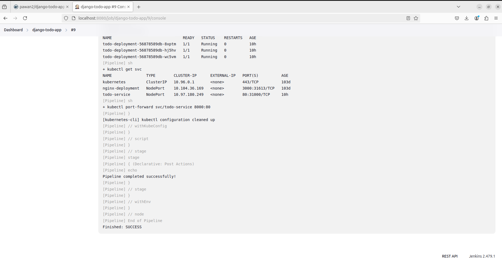
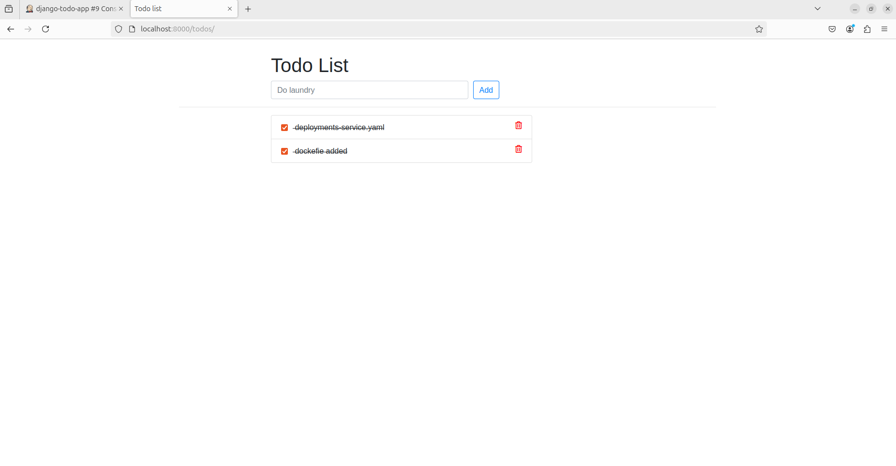

## Test the CI/CD Pipeline

To test the CI/CD pipeline, the following steps were performed:

1. **Change the Application Code**: A modification was made to the application code to simulate a real-world update, such as changing the title, placeholder.

2. **Push the Changes to the Git Repository**: The updated code was pushed to the GitHub repository, triggering the Jenkins pipeline.

3. **Jenkins Pipeline Execution**: Upon detecting the code changes, Jenkins automatically triggered the pipeline, and the following actions were performed:
   - **Building the Docker Image**: Jenkins built a new Docker image with the updated code with auto-increment of version such as v1.1.
   - **Pushing the Docker Image to the Docker Registry**: The newly built Docker image was pushed to the Docker registry.
   - **Deploying the Updated Application to Kubernetes**: The updated application was deployed to the Kubernetes cluster using the `kubectl apply -f deployment-service.yaml` command.

4. **Verification**: The deployment was verified by checking the status of the pods and services in the Kubernetes cluster, ensuring the application was correctly deployed.

Here is an image showing the Jenkins pipeline running successfully:
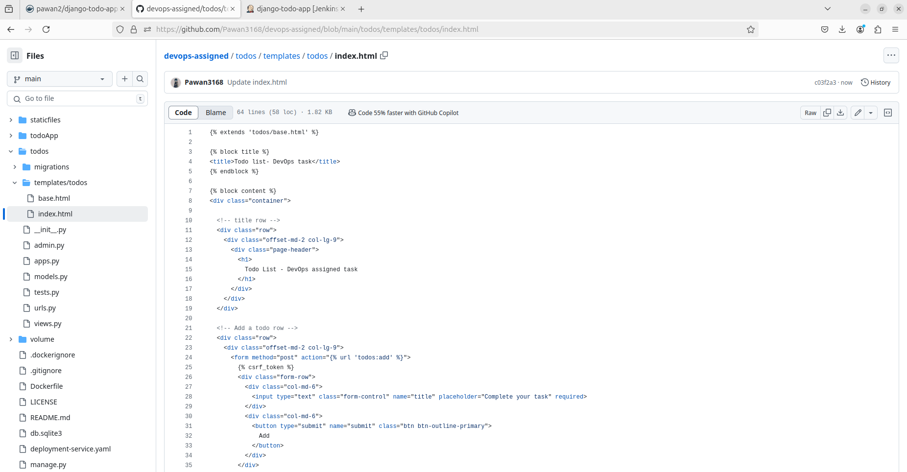
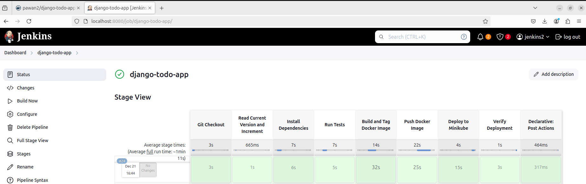
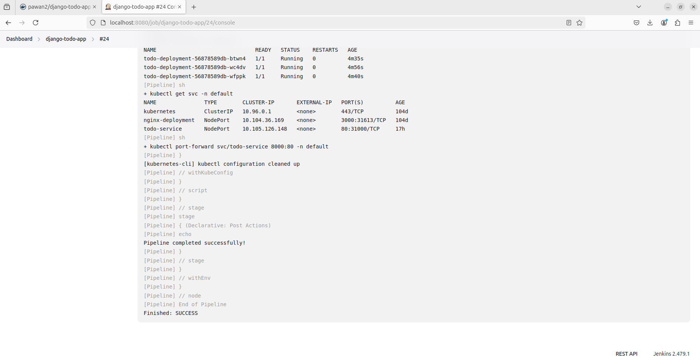
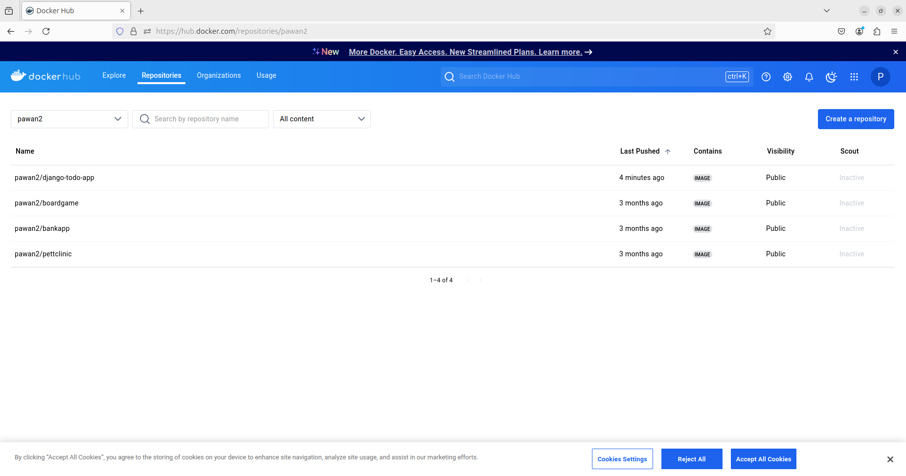
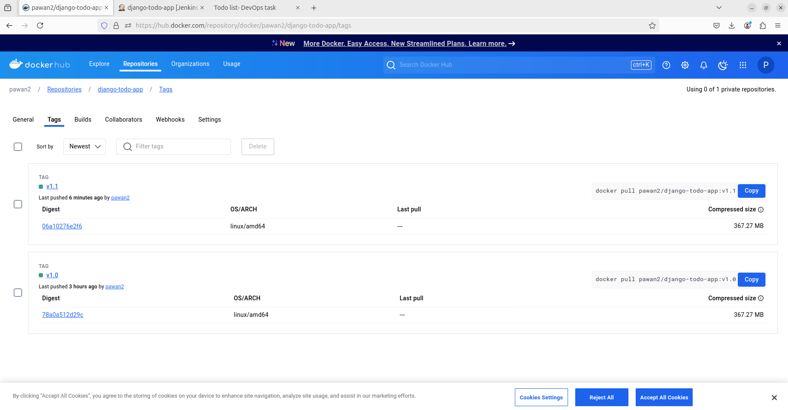


This test ensures that any code change automatically triggers the pipeline and performs the necessary steps to build, push, and deploy the updated application.


